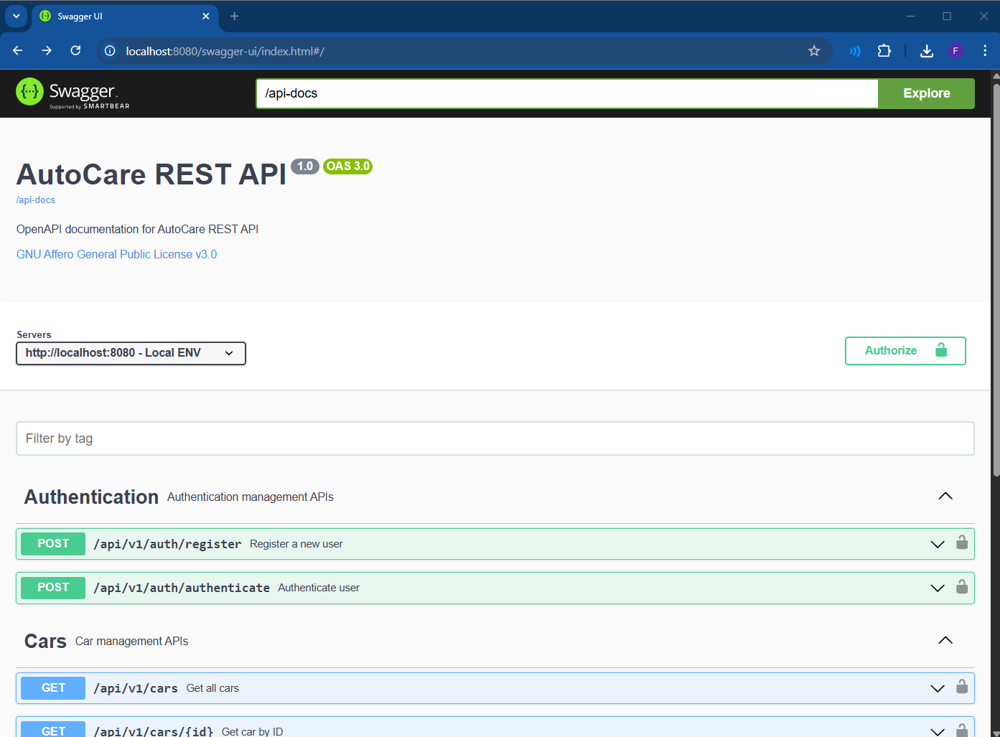

# AutoCare REST API Sample

[](https://github.com/firasrg/auto-care/actions/workflows/code-analysis.yaml)
[](https://img.shields.io/badge/Java-17-f0fc03)

[](https://sonarcloud.io/summary/new_code?id=firasrg_autocare-rest-api)
[](https://sonarcloud.io/summary/new_code?id=firasrg_autocare-rest-api)
[](https://sonarcloud.io/summary/new_code?id=firasrg_autocare-rest-api)
[](https://sonarcloud.io/summary/new_code?id=firasrg_autocare-rest-api)

## Overview

The **AutoCare REST API** 🚗🧑‍🔧  offers a comprehensive solution for managing vehicle services . This developer-friendly project is designed to enhance proficiency with modern Spring applications, providing hands-on experience with real-world scenarios and best practices for backend development.

**Goals** :

- Enhance problem-solving skills by tackling real-world challenges (appointment, invoice, and communication).
- Gain hands-on experience in modern REST Web Applications.
- Improve proficiency in Java and related frameworks.
- Learn how to effectively use Git and GitHub.
- Develop skills in documentation and testing.

## Features

- **OpenAPI & Swagger**: documented endpoints with OpenAPI 3.0 and Swagger UI for easy API exploration.
- **JWT Authentication**: secure API with JSON Web Tokens for user authentication.

## Technology Stack

- **Framework**: [Spring Boot](https://docs.spring.io/spring-boot/index.html) v3.2 (Spring v6)
- **Languages**: Java v17
- **Build Tool**: [Maven](https://maven.apache.org/) v3.9
- **Code Style**: [Checkstyle](https://checkstyle.sourceforge.io/) and [Spotless](https://github.com/diffplug/spotless)
- **Version Control**: Git

## Getting Started

1. **Clone the repository**

```bash
git clone <GITHUB_REPOSITORY_URL>
cd autocare-rest-api
```

2. **Build**
```bash 
./mvnw clean install
```

3. **Run**
```bash
./mvnw spring-boot:run "-Dspring-boot.run.profiles=demo"
```
_Note: Currently, the app doesn't have endpoints for CRUD operations yet (except one `GET/api/cars`). The `demo` profile refers to `../configs/LoadDatabase`, which helps to fill database with some data at runtime._

4. **Check Endpoint**:

From Web-browser check the following URL `http://localhost:8080/swagger-ui/index.html` :



**Authentication Endpoint**

The API provides an authentication endpoint at `/api/v1/auth`.

- **Purpose:** Allows users to authenticate and obtain a token for accessing secured endpoints.
- **How to use:**
    - Locate the `/api/v1/auth` endpoint in the list.
    - Expand the endpoint to view its details and try it out.
    - Provide the required credentials (e.g., username and password) in the request body.
    - Execute the request to receive an authentication token in the response.

5. **Check Database**:

Currently, there is only the [H2 Database](https://www.h2database.com/html/main.html) to demonstrate the app while in DEV mode. SpringBoot autoconfigures H2 database :

Check the app's log, make sure to have something like this :
```bash
INFO ... Added connection conn0: url=jdbc:h2:mem:a917d8a4-bb16-46a1-84a4-f59d60f01ca8 user=SA
INFO ... H2 console available at '/h2-console'. Database available at 'jdbc:h2:mem:a917d8a4-bb16-46a1-84a4-f59d60f01ca8'
```

Next, from web-browser, try the following URL : `http://localhost:8080/h2-console`. This will take you to H2 console webpage: 


Copy, paste your database URL and username from your app's log and press on `Connect` button :


There you go 🎉!

## Contributing 

If you want to dive in this project and help us to improve it, please read and follow our [contributing guidelines](./CONTRIBUTING.md).
